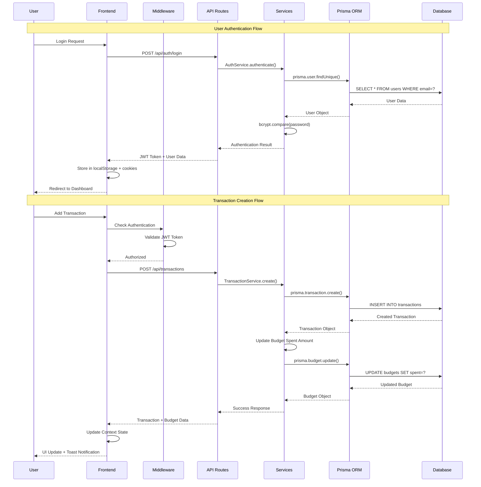
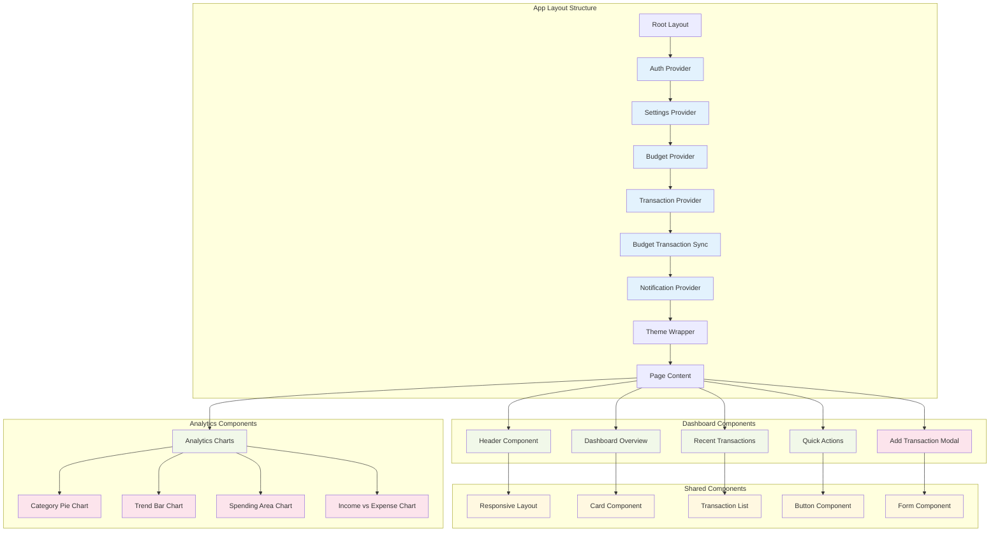
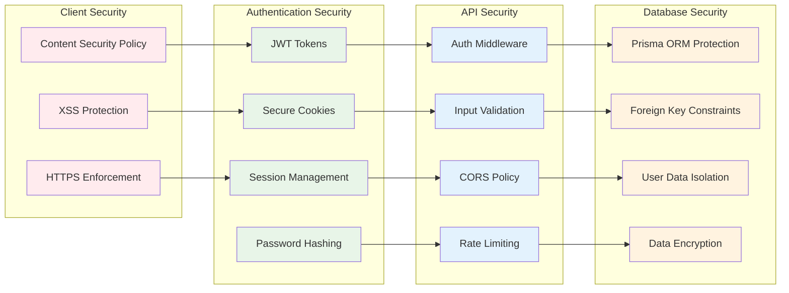
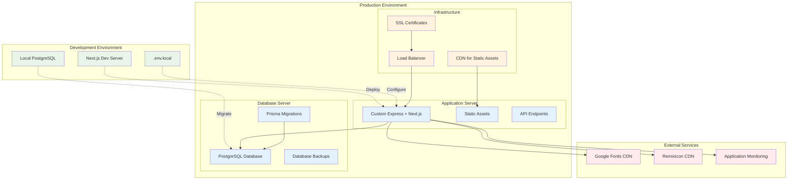

# Smart Budget App - Architecture Diagram

## System Architecture Overview

```mermaid
graph TB
    %% User Layer
    subgraph "Client Layer"
        Browser[Web Browser]
        Mobile[Mobile Browser]
    end

    %% Frontend Layer
    subgraph "Frontend Application (Next.js 14)"
        subgraph "Pages & Components"
            Dashboard[Dashboard Page]
            Analytics[Analytics Page]
            Auth[Auth Pages]
            Budgets[Budget Management]
        end
        
        subgraph "State Management"
            AuthCtx[Auth Context]
            TransCtx[Transaction Context]
            BudgetCtx[Budget Context]
            SettingsCtx[Settings Context]
            NotifCtx[Notification Context]
        end
        
        subgraph "UI Components"
            Charts[Recharts Components]
            Forms[Form Components]
            Modals[Modal Components]
            Layout[Layout Components]
        end
    end

    %% Middleware Layer
    subgraph "Middleware & Routing"
        NextMiddleware[Next.js Middleware]
        AuthGuard[Route Protection]
        APIRoutes[API Routes]
    end

    %% Backend Layer
    subgraph "Backend Services"
        subgraph "Express Server"
            CustomServer[Custom Express Server]
            StaticFiles[Static File Serving]
        end
        
        subgraph "API Endpoints"
            AuthAPI[/api/auth/*]
            TransAPI[/api/transactions]
            BudgetAPI[/api/budgets]
            DemoAPI[/api/demo/*]
        end
        
        subgraph "Business Logic"
            AuthService[Authentication Service]
            TransService[Transaction Service]
            BudgetService[Budget Service]
            DemoService[Demo Data Service]
        end
    end

    %% Data Layer
    subgraph "Data Access Layer"
        PrismaORM[Prisma ORM]
        DatabaseLib[Database Library]
        Validation[Data Validation]
    end

    %% Database Layer
    subgraph "PostgreSQL Database"
        UserTable[(Users Table)]
        TransTable[(Transactions Table)]
        BudgetTable[(Budgets Table)]
    end

    %% External Services
    subgraph "External Dependencies"
        BCrypt[bcryptjs - Password Hashing]
        Fonts[Google Fonts]
        Icons[RemixIcon]
    end

    %% Connections
    Browser --> Dashboard
    Mobile --> Dashboard
    
    Dashboard --> AuthCtx
    Analytics --> TransCtx
    Auth --> AuthCtx
    Budgets --> BudgetCtx
    
    AuthCtx --> NextMiddleware
    TransCtx --> APIRoutes
    BudgetCtx --> APIRoutes
    
    NextMiddleware --> AuthGuard
    AuthGuard --> APIRoutes
    
    APIRoutes --> AuthAPI
    APIRoutes --> TransAPI
    APIRoutes --> BudgetAPI
    APIRoutes --> DemoAPI
    
    AuthAPI --> AuthService
    TransAPI --> TransService
    BudgetAPI --> BudgetService
    DemoAPI --> DemoService
    
    AuthService --> PrismaORM
    TransService --> PrismaORM
    BudgetService --> PrismaORM
    DemoService --> PrismaORM
    
    PrismaORM --> UserTable
    PrismaORM --> TransTable
    PrismaORM --> BudgetTable
    
    UserTable -.->|1:N| TransTable
    UserTable -.->|1:N| BudgetTable
    BudgetTable -.->|1:N| TransTable
    
    AuthService --> BCrypt
    Dashboard --> Charts
    Dashboard --> Fonts
    Dashboard --> Icons

    %% Styling
    classDef frontend fill:#e1f5fe
    classDef backend fill:#f3e5f5
    classDef database fill:#e8f5e8
    classDef external fill:#fff3e0
    
    class Dashboard,Analytics,Auth,Budgets,AuthCtx,TransCtx,BudgetCtx,SettingsCtx,NotifCtx,Charts,Forms,Modals,Layout frontend
    class CustomServer,StaticFiles,AuthAPI,TransAPI,BudgetAPI,DemoAPI,AuthService,TransService,BudgetService,DemoService,NextMiddleware,AuthGuard,APIRoutes backend
    class PrismaORM,DatabaseLib,Validation,UserTable,TransTable,BudgetTable database
    class BCrypt,Fonts,Icons external
```

## Data Flow Architecture



## Component Architecture



## Security Architecture



## Deployment Architecture



## Technology Stack Diagram

```mermaid
graph TD
    subgraph "Frontend Stack"
        React[React 18]
        NextJS[Next.js 14]
        TypeScript[TypeScript 5]
        Tailwind[Tailwind CSS]
        Recharts[Recharts]
    end

    subgraph "Backend Stack"
        Express[Express.js]
        NodeJS[Node.js]
        Prisma[Prisma ORM]
        BCryptJS[bcryptjs]
    end

    subgraph "Database Stack"
        PostgreSQL[PostgreSQL]
        PrismaClient[Prisma Client]
        Migrations[Database Migrations]
    end

    subgraph "Development Tools"
        ESLint[ESLint]
        PostCSS[PostCSS]
        Autoprefixer[Autoprefixer]
    end

    subgraph "UI/UX Libraries"
        ReactHotToast[React Hot Toast]
        GoogleFonts[Google Fonts]
        RemixIcon[RemixIcon]
        TailwindAnimate[Tailwind Animate]
    end

    React --> NextJS
    NextJS --> TypeScript
    TypeScript --> Tailwind
    Tailwind --> Recharts

    Express --> NodeJS
    NodeJS --> Prisma
    Prisma --> BCryptJS

    PostgreSQL --> PrismaClient
    PrismaClient --> Migrations

    ESLint --> PostCSS
    PostCSS --> Autoprefixer

    ReactHotToast --> GoogleFonts
    GoogleFonts --> RemixIcon
    RemixIcon --> TailwindAnimate

    %% Styling
    classDef frontend fill:#e1f5fe
    classDef backend fill:#f3e5f5
    classDef database fill:#e8f5e8
    classDef tools fill:#fff3e0
    classDef ui fill:#fce4ec
    
    class React,NextJS,TypeScript,Tailwind,Recharts frontend
    class Express,NodeJS,Prisma,BCryptJS backend
    class PostgreSQL,PrismaClient,Migrations database
    class ESLint,PostCSS,Autoprefixer tools
    class ReactHotToast,GoogleFonts,RemixIcon,TailwindAnimate ui
```



---

## Architecture Principles

### 1. **Separation of Concerns**
- Clear separation between presentation, business logic, and data layers
- Context-based state management for different domains
- Modular component architecture

### 2. **Type Safety**
- Full TypeScript implementation across frontend and backend
- Prisma-generated types for database operations
- Strict type checking for API contracts

### 3. **Security First**
- Multi-layered authentication and authorization
- Input validation and sanitization
- Secure session management

### 4. **Performance Optimization**
- Server-side rendering with Next.js
- Optimistic UI updates
- Efficient data fetching and caching

### 5. **Scalability**
- Modular architecture supporting feature additions
- Database design supporting multi-tenancy
- API-first approach enabling multiple clients

### 6. **User Experience**
- Responsive design for all devices
- Progressive enhancement
- Accessibility compliance
- Real-time feedback and notifications